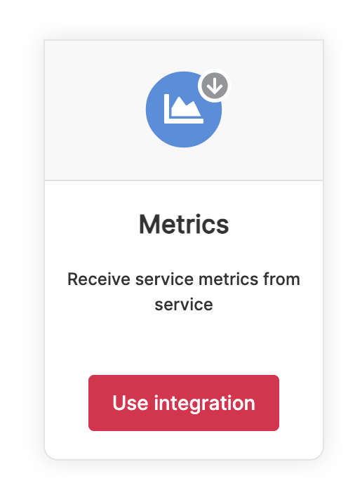
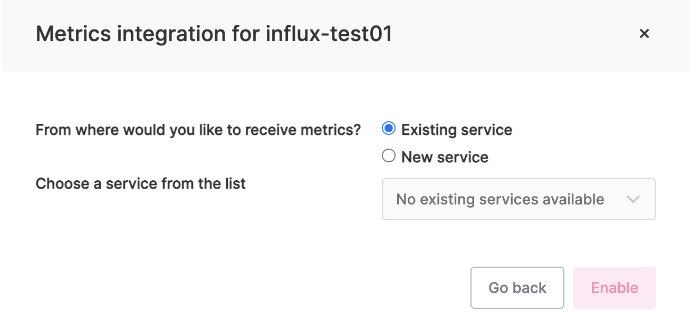
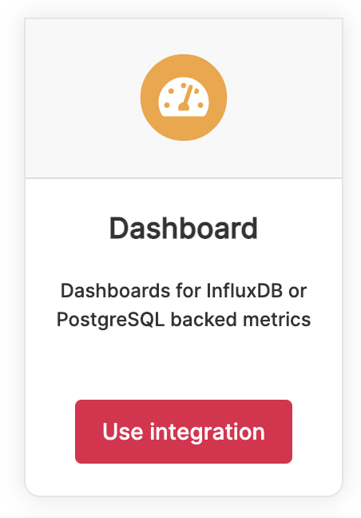
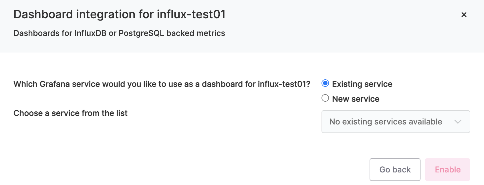
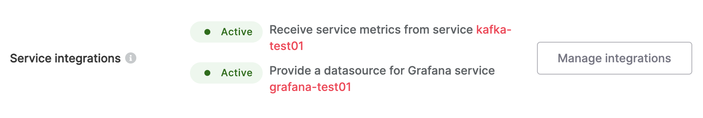
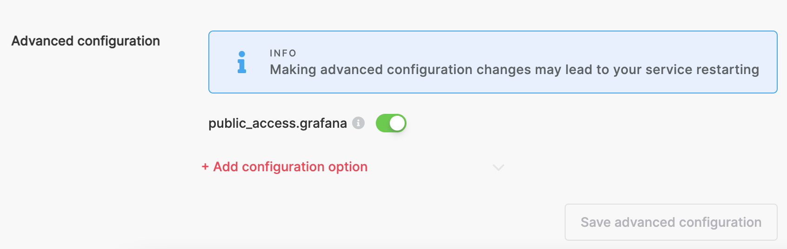
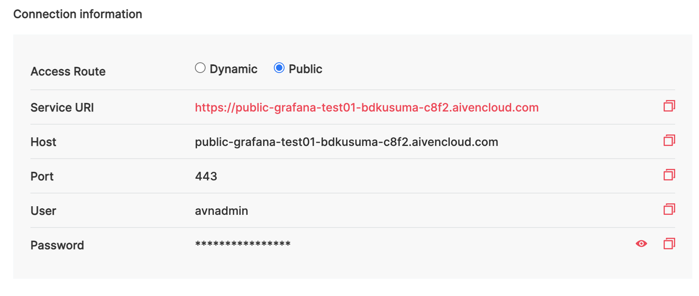

# Aiven Kafka annd Observability

Using **Aiven Kafka** for fast setup and deploying a new Kafka cluster has its own advantage. It can eliminate the time and hassle of setting up the server and installing and configuring Kafka cluster it self.

One of many advantage of using **Aiven Kafka** are when you select all the necessary parameter for Creating **Aiven Kafka** Services, you will see that **Aiven Kafka** will directly setting up minimum of cluster requirement of Kafka which is 3 nodes with a proper CPU, RAM and Storage.

One of main factor of having high availability Kafka cluster performance is not enough just having a proper cluster running. You also need to have Observe the Cluster performance so You can fine tune or tweak the producers and comsumers application and make a important decision when to scale the Kafka Cluster

Most usefull advantage using **Aiven Kafka** are, it can be integrate with Timeseries Database `InfluxDB, M3DB or PostgreSQL service`. And this Timeseries Database can be easily integrate to `Grafana` Dashboard for fast & flexible visualizations any way you want.

To integrate **Aiven Kafka** to `InfluxDB` and `Grafana` as easy as click the **Manage Integrations** button in **Service integrations** section. Just follow the step below.

**Steps :**
1. Create Services of InfluxDB and Grafana
   
2. After both running go to InfluxDB service Overview tab and scroll down. Click the **Manage Integrations** button in **Service integrations** section.

3. Select **Metrics** and click on **Use Integration** button.   

4. Choose **Existing Service** and the service you want to receive from the list, in this case is Kafka.   

5. Select **Dashboard** and click on **Use Integration** button.   

6. Choose **Existing Service** and the service you want to receive from the list, in this case is Grafana.   

7. At the Overview tab you can see both integration will be active.   

8. Now You can go to Grafana services.
   
9.  If you need to access the Grafana Dashboard from Public you can set it up by add the **Add configuration option** `public_access.grafana` on **Advanced Configuration**. Save Advanced Configuration.   

10. You will see **Public** on **Connection information** and You visit newly setup **Grafana** using **Service URI** address and use `User` and `Password` provided.   
