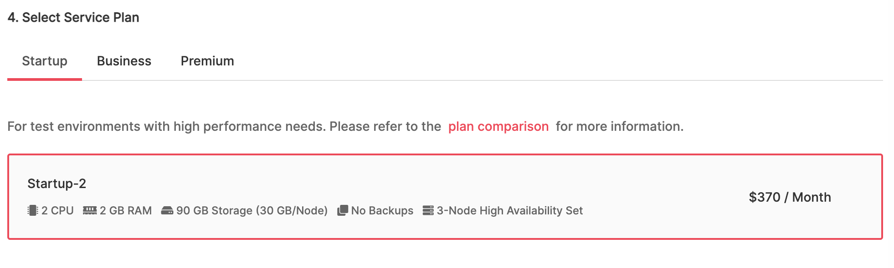

# Aiven Kafka Quickstart with NodeJS Framework

Fisrt thing first, we need to setup Aiven kafka to do this up and running.

1. Go to https://console.aiven.io/signup for signing up
2. After the signin procees go to your project dashboard
3. Go to Services tab on the left side bar
4. You will see red "Create a new service" button on the right.<br/><br/> 

5. click the red "Create a new service" it to go to see all Aiven available services. Select **Kafka**<br/><br/> 

1. Scroll Down to **Select Cloud Service Provider**. Select one of the provider.<br/><br/> 

7. Scroll Down to **Select Service Cloud Region**. Select one of the Region.<br/><br/> 

1. Scroll Down to **Select Service Plan**. Select one of the Plan.<br/><br/> 

9. Scroll Down to **Provide Service Name**. Edit the name.<br/><br/> 

10. Last You will see on the right the detail list of the selection and you caan continue by pressing the **Create Service** button.<br/><br/> 


Now your **Kafka services** will be rebuilding all 3 nodes *(blue dots)*. When you see all Dots turns into Green, the services are **Running**

## Configuration

In Order to access the service from your `http://localhost`, You need to add *Advanced Configuration*

1. Click into your **Kafka Services**
2. At the **Overview tab** Scroll down to the bottom aand You will see **Advanced Configuration** 
3. Click **Add Configuration Option** and Select *`public_access.kafka`* and also *`kafka_authentication_methods.certificate`* and *`kafka.auto_create_topics_enable`* for development purposes.<br/><br/> 

4. Scroll back to top of the page and You will see **Connection information** section<br/><br/> 

5. Select **Public** and copy the information and download the *`Access Key`*, *`Access Certificate`*, *`CA Certificate`* 

For the downloaded *`Access Key`*, *`Access Certificate`*, *`CA Certificate`* You can move it to cert folder in the apps folder after you download the project of **Aiven Kafka NodeJS Application Example**

---

# Aiven Kafka NodeJS Application Example

### Install
`npm install`

*note: if you having trouble with node-gyp `error` on macOS, just run `node-gyp rebuild` after `npm install` (read **node-gyp error** section below)*

## Run Application
`npm run start`

The Application will run at http://localhost:3000
*note: You can change the port number on `config/config.json` file*

## API
### Create Topic
`method : PUT`

`end point : /topic/create`

Body :
```
{
    "topic": "topic name",
    "partitions": 0,
    "replicationFactor":2
}
```

### Send Topic Data
`method : POST`

`end point : /topic/data`

Body :
```
{
   "topic": "topic name",
   "message": "message body", 
   "partition":0
}
```

### Topic List
`method : GET`

`end point : /topic/list`

### Topic Describe
`method : POST`

`end point : /topic/describe`

Body :
```
{
   "topic": "topic name",
}
```

### View Topic Data
`method : POST`

`end point : /topic/message/`

Body :
```
{
   "topic": "topic name",
   "partition":0,
   "offset":0,
}
```

## Node-Gyp Error

Create file name `binding.gyp` at the `root` project and insert this inside the file

```
{
	"targets": [
		{
			"target_name": "binding",
			"sources": [ "build/Release/binding.node" ]
		}
	]
}
```
run `node-gyp rebuild`